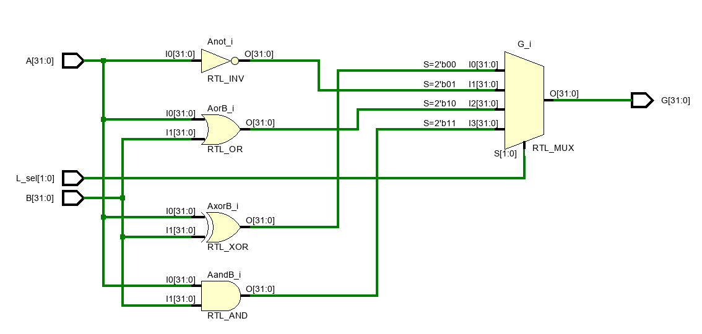
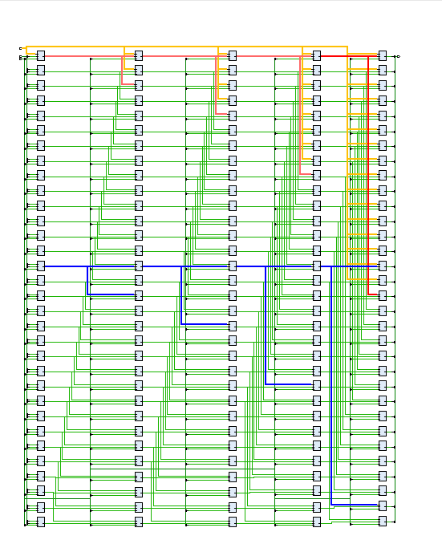
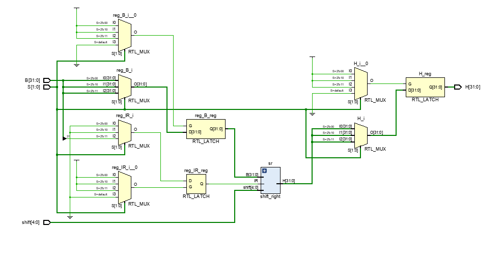

# Function Unit with ALU and Shifter

## ALU Design 

### High Level Overview
The ALU should be able to apply arithmetic and logic operations between two XLEN integers which in our case XLEN is 32. The module should include necessary addition, subtraction and  finally common OR, XOR, AND logical operations should be supported.

### Selection Signals
The minimal set of signals which are adequate to differentiate between instructions are the 3 bits in [14:12] aka. funct3 and bit [30] which is the 6th bit of funct7.

Depending on the third bit of funct3 which is the 14th bit, the arithmetic or logical instructions are used. 
Bit 30 is used to differentiate addition and subtraction.
Funct3 is used to select logical operations as stated in the RISC-V reference.

### Status Signals
Zero, Carry, Negative and Overflow flags are the output flags of the ALU and they are bundled in ZCNV sequence. Each has a detection circuit.

Zero is checked by OR'ing all bits and NOT'ing the result.
```
assign ZCNVFlags[3] = !(|Arithmetic_result);
```
Carry is connected to the corresponding output of the adder/subtractor.
Negative is connected directly to the 31st bit of the result.
Addition and subtraction are detected with the bit 30 as stated:
```
ADD => G_sel[0] == 0 
SUB => G_sel[0] == 1
```

Overflow detection circuit consists of the following logic:
- if in addition both A and B are positive and the result is negative or both A and B are negative and the result is positive 
OR 
- if in subtraction A is negative and B is positive and the result is positive or A is positive and B is negative and the result is negative

Under these conditions, overflow is detected. The circuit is as the following:
```
assign ZCNVFlags[0] =   
(!G_sel[0] & A_signed[31] & B_signed[31] & !Arithmetic_result[31]) | 
(!G_sel[0] & !A_signed[31] & !B_signed[31] & Arithmetic_result[31])|
(G_sel[0] & A_signed[31] & !B_signed[31] & !Arithmetic_result[31])|
(G_sel[0] & !A_signed[31] & B_signed[31] & Arithmetic_result[31]);
```
### Sub-Blocks
The selected adder/subtractor unit will be used in ADD and SUB instructions. The logical unit will contain gates assigned to OR, XOR and AND.
### Function Table 
| $S_2$ | $S_1$ | $S_0$ | $C_{in}$ | Operation   | Function | 
| ----- | ----- | ----- | -------- | ----------- | -------- |
| 0     | 0     | 0     | 0        | $G = A + B$ | Addition |
| 0     | 0     | 0     | 0        | $G = A - B$ | Subtraction |
| 1     | 0     | 0     | 0        | $G = A \oplus B$ | XOR |
| 1     | 1     | 0     | 0        | $G = A \lor B$ | OR |
| 1     | 1     | 1     | 0        | $G = A \land B$ | AND |


## ALU Implementation

### Adder/Subtractor Topology
Modified Ripple Carry Adder to host subtraction was used in a parameterised way.
### Synthesis of ALU
RTL Schematic of Arithmetic and Logic Unit:



### Behavioural Simulation of ALU


## Shifter Design
Arithmetic and logical shifts to both right and left need to be supported. An exception is apparently an arithmetic left shift which is not in the RISC-V standard. 
### Shifter Input/Outputs

The shift amount is going to be $log_2(XLEN)$ which is input to the shifter. Unlike ALU the shifter takes one input XLEN sized integer.

### Selection Signals
Two select signals are used to select between arithmetic-logical and right-left.
When the reference is analyzed it can be seen that bit 30 and bit 14 which is third bit of funct3 are appropriate for selection.
Bit 30 is used to select arithmetic shifts and bit 14 is used to select right or left shifts.

### Function Table
| $S_1$ | $S_0$ | Operation   | Function | 
| ----- | ----- | ----- | -------- | 
| 0     | 0        | $G = A << B$ |Logical  Shift Left |
| 1     | 0        | $G = A >> B$ | Logical  Shift Rigth  |
| 1     | 1        | $G = A >>> B$ | Artihmetic Shift Right |

## Shifter Implementation

### Topology
Barrel shifter topology with parameterised design is used to have a shift in one clock cycle. The design is open sourced and can be found [here](https://gist.github.com/Eymay/1deab2b5f6dbad6da82ea82f3d49aed9)



### Synthesis of Shifter
RTL Schematic of Shifter:


### Behavioural Simulation of Shifter
Simulation of SLL

Simulation of SLR


Simulation of SRA


## Integration of ALU and Shifter in Functional Unit

### Synthesis of FU

RTL Schematic of Functional Unit:


### Behavioural Simulation of Shifter


